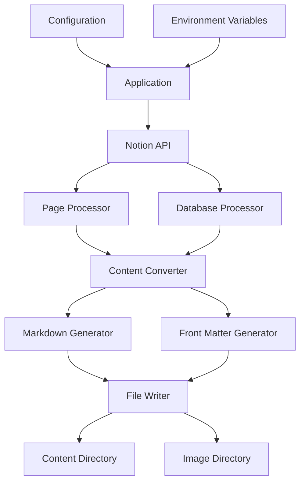

# Notion to Markdown

A powerful tool that transforms Notion pages and databases into Markdown files with front matter, designed for static site generators like Hugo.

## Overview

Notion to Markdown is a Node.js application that serves as a bridge between Notion as a content management system and static site generators. It fetches content from Notion using the official API, converts it to Markdown format with appropriate front matter, and organizes the files in a structure suitable for static site generators like Hugo.

## Features

- **Page & Database Support**: Convert both individual Notion pages and entire databases to Markdown
- **Custom Front Matter**: Generate Hugo-compatible YAML front matter from Notion properties
- **Rich Content Conversion**: Convert Notion blocks to Markdown, including:
  - Text formatting (bold, italic, code, etc.)
  - Headings, lists, and quotes
  - Code blocks with language specification
  - Images and other media
  - Tables and callouts
  - Mathematical equations
- **Smart Image Handling**: Downloads and stores images locally with proper references
- **Incremental Updates**: Only processes pages that have changed since the last run
- **Draft Status**: Respects Notion's status property to mark content as draft
- **Content Cleanup**: Removes Markdown files for pages that no longer exist in Notion
- **Docker Support**: Run as a containerized application using Docker

## How It Works

### Core Process

1. **Authentication**: Connect to Notion API using a secure integration token
2. **Configuration Loading**: Load mapping configuration for pages and databases
3. **Content Fetching**: Retrieve pages and database entries from Notion
4. **Markdown Conversion**: Transform Notion blocks to Markdown format
5. **Front Matter Generation**: Create YAML front matter from page properties
6. **File System Operations**: Save Markdown files to the content directory
7. **Cleanup**: Remove files for deleted Notion pages

### Data Flow Architecture



### Component Details

#### Configuration System

The application is driven by a configuration file (`notion-hugo.config.ts`) that defines:

- **Page Mounts**: Direct mapping of Notion pages to target folders
- **Database Mounts**: Mapping of Notion databases to target folders
- **Manual Mode**: Option to manually specify page/database IDs or use environment variables

#### Notion API Integration

Using the official Notion API client to:
- Fetch pages and their content
- Query databases and their entries
- Handle pagination for large datasets
- Process rich text and blocks

#### Content Rendering System

The rendering process includes:
1. Fetching all blocks from a page using pagination
2. Converting block structure to an internal representation
3. Applying custom transformers for specific block types
4. Managing nested blocks and their relationships
5. Processing rich text with formatting
6. Tracking expiry times for Notion assets

#### File System Management

The system:
- Creates directories as needed
- Writes Markdown files with front matter
- Tracks file metadata to detect changes
- Downloads and stores images locally
- Cleans up orphaned files and images

#### Intelligent Tracking System

To optimize performance and avoid unnecessary processing:
- Tracks page modification times
- Compares local content with Notion content
- Manages URL expiry for Notion assets
- Detects renamed pages and handles file updates

## Installation and Usage

### Prerequisites

- Node.js 16 or higher
- Notion integration token with access to your content
- (Optional) Docker for containerized usage

### Setup

1. Clone this repository:
   ```bash
   git clone https://github.com/damianflynn/notion-to-markdown.git
   cd notion-to-markdown
   ```

2. Install dependencies:
   ```bash
   npm install
   ```

3. Create a `.env` file with your Notion token:
   ```
   NOTION_TOKEN=your_notion_integration_token
   ```

4. Configure your Notion pages and databases in `notion-hugo.config.ts`:
   ```typescript
   import { UserConfig } from "./src/config"

   const userConfig: UserConfig = {
       mount: {
           manual: false,
           page_url: 'https://www.notion.so/your-page-url',
           pages: [
               {
                   page_id: 'your_page_id',
                   target_folder: 'about'
               }
           ],
           databases: [
               {
                   database_id: 'your_database_id',
                   target_folder: 'posts'
               }
           ],
       }
   }

   export default userConfig;
   ```

### Running the Application

```bash
npm start
```

This will:
1. Connect to your Notion workspace
2. Process all configured pages and databases
3. Generate Markdown files in the content directory
4. Download images to the static/images directory

### Docker Usage

#### Using the Pre-built Image

```bash
docker pull ghcr.io/damianflynn/notion-to-markdown:latest

docker run -e NOTION_TOKEN=your_token \
           -v ./notion-hugo.config.ts:/app/notion-hugo.config.ts \
           -v ./content:/app/content \
           -v ./static:/app/static \
           ghcr.io/damianflynn/notion-to-markdown
```

#### Building Your Own Image

```bash
docker build -t notion-to-markdown .

docker run -e NOTION_TOKEN=your_token \
           -v ./notion-hugo.config.ts:/app/notion-hugo.config.ts \
           -v ./content:/app/content \
           -v ./static:/app/static \
           notion-to-markdown
```

#### Using Docker Compose

Create a `docker-compose.yml` file:

```yaml
version: '3'
services:
  notion-to-markdown:
    image: ghcr.io/damianflynn/notion-to-markdown:latest
    environment:
      - NOTION_TOKEN=your_token
      # Optional environment variable configuration:
      - NOTION_PAGE_URL=https://www.notion.so/your-page-url
      - NOTION_PAGE_IDS=pageid1:folder1,pageid2:folder2
      - NOTION_DATABASE_IDS=dbid1:folder1,dbid2:folder2
    volumes:
      - ./notion-hugo.config.ts:/app/notion-hugo.config.ts
      - ./content:/app/content
      - ./static:/app/static
```

Then run:

```bash
docker-compose up
```

## Configuration Options

### Basic Configuration

The `notion-hugo.config.ts` file supports:

- **manual**: Set to true to use only explicit page/database IDs
- **page_url**: Main Notion page URL (used if manual is false)
- **pages**: Array of page ID mappings
- **databases**: Array of database ID mappings

### Environment Variables

You can configure the application using environment variables:

- **NOTION_TOKEN**: Your Notion integration token
- **NOTION_PAGE_URL**: The URL of your main Notion page
- **NOTION_PAGE_IDS**: Comma-separated list of page_id:target_folder pairs
- **NOTION_DATABASE_IDS**: Comma-separated list of database_id:target_folder pairs

### Advanced Page Processing

The system provides advanced features for page processing:

- Pages with "Draft" status will be marked as drafts in front matter
- Pages with "Published" status will not be draft
- Properties from Notion are mapped to front matter fields
- Cover images are downloaded and referenced locally
- Authors and other metadata are preserved

## Development

### Project Structure

```
notion-to-markdown/
├── src/
│   ├── index.ts            # Main entry point
│   ├── config.ts           # Configuration handling
│   ├── render.ts           # Page rendering
│   ├── file.ts             # File system operations
│   ├── helpers/            # Utility functions
│   ├── markdown/           # Markdown conversion
│   │   ├── notion-to-md.ts # Notion to Markdown converter
│   │   ├── md.ts           # Markdown utilities
│   │   └── types.ts        # TypeScript type definitions
│   └── utils/              # General utilities
├── notion-hugo.config.ts   # User configuration
├── package.json            # Project dependencies
├── tsconfig.json           # TypeScript configuration
└── Dockerfile              # Docker configuration
```

### Building from Source

```bash
# Install dependencies
npm install

# Build TypeScript code
npm run build

# Run the application
npm start

# Format code
npm run format
```

### Debugging

This project includes VS Code debugging configuration in `.vscode/launch.json`. To debug:

1. Set breakpoints in your TypeScript files
2. Press F5 or use the "Run and Debug" panel
3. Select "Debug Typescript" from the configuration dropdown

## Common Use Cases

### Integration with Hugo

1. Set up Notion-to-Markdown to output to your Hugo content directory
2. Run the tool to generate Markdown files
3. Use Hugo to build your site from the generated content

### Automated Content Pipeline

1. Set up Notion as your content management system
2. Configure Notion-to-Markdown with your page structure
3. Use GitHub Actions or another CI/CD system to run Notion-to-Markdown periodically
4. Automatically build and deploy your static site with the fresh content

### Multiple Content Sources

You can configure multiple databases and pages to create different sections of your site:

- A database for blog posts
- A database for projects or portfolio items
- Individual pages for about, contact, etc.

## Troubleshooting

### Common Issues

- **Authentication Errors**: Verify your Notion token has the correct permissions
- **Missing Content**: Check page/database IDs in your configuration
- **Image Loading Issues**: Ensure image directories are writable
- **Rate Limiting**: Implement delays between requests for large sites

### Logs and Debugging

The application outputs detailed logs:
- `[Info]` messages for normal operation
- `[Debug]` messages for detailed troubleshooting
- `[Warning]` messages for potential issues
- `[Error]` messages for failures

## Contributing

Contributions are welcome! Please feel free to submit a Pull Request.

1. Fork the repository
2. Create your feature branch (`git checkout -b feature/amazing-feature`)
3. Commit your changes (`git commit -m 'Add some amazing feature'`)
4. Push to the branch (`git push origin feature/amazing-feature`)
5. Open a Pull Request

## License

This project is licensed under the GNU General Public License v3.0 - see the LICENSE file for details.

## Acknowledgments

- The Notion API team for providing a powerful API
- The Hugo community for inspiration

